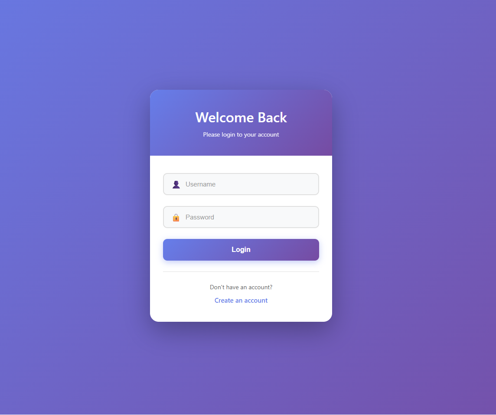
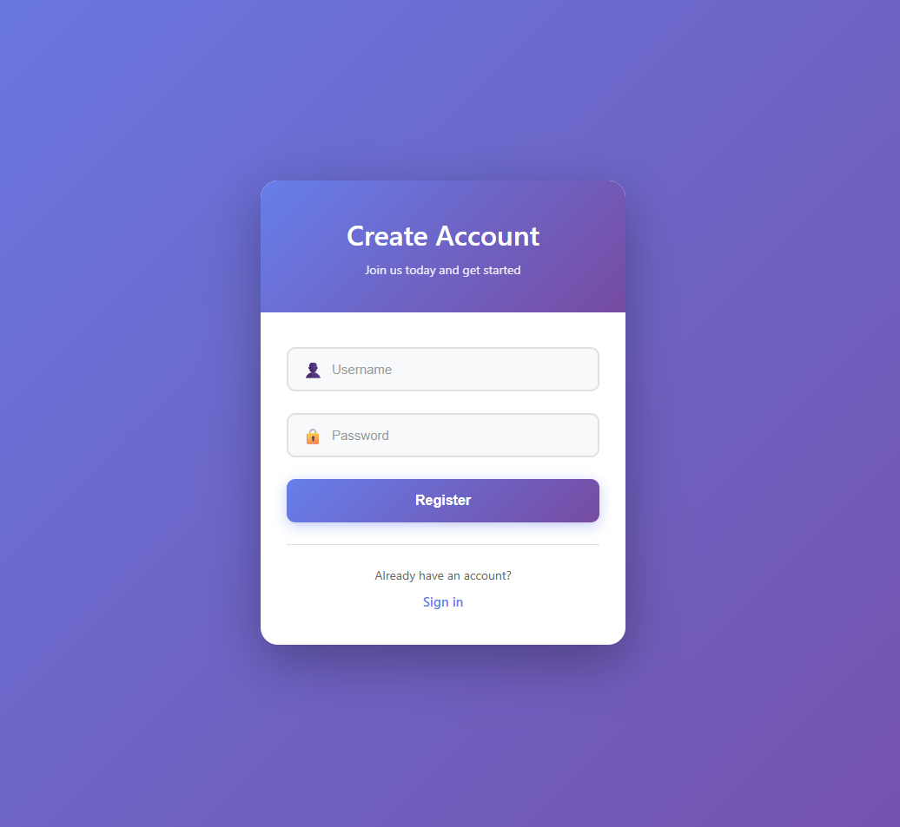
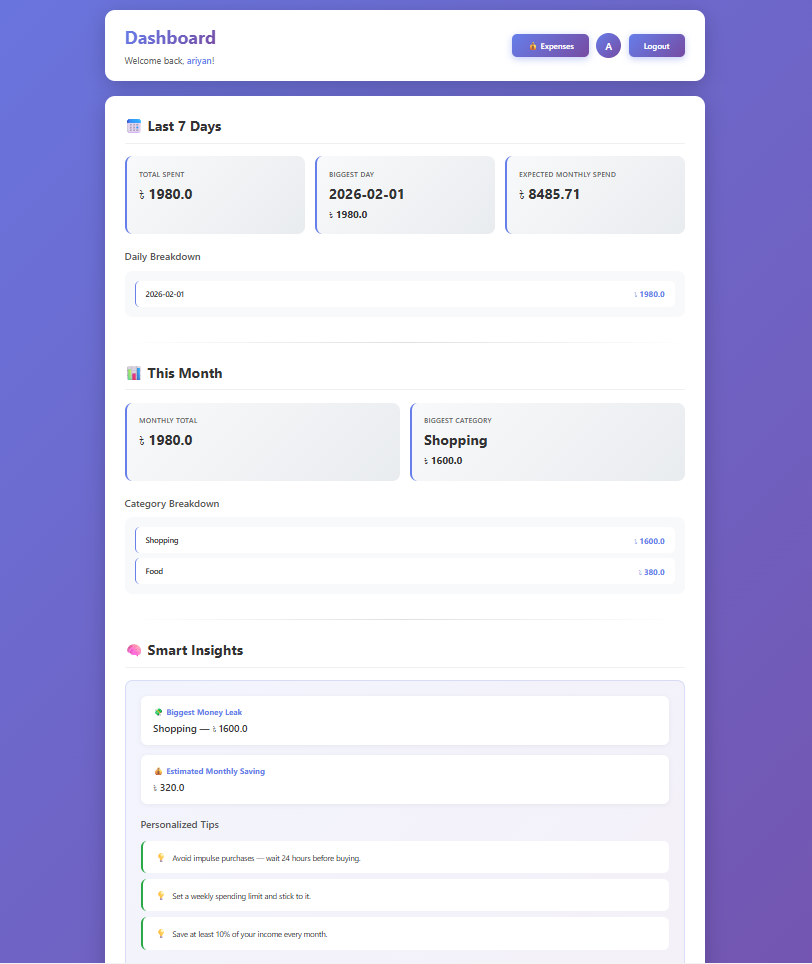
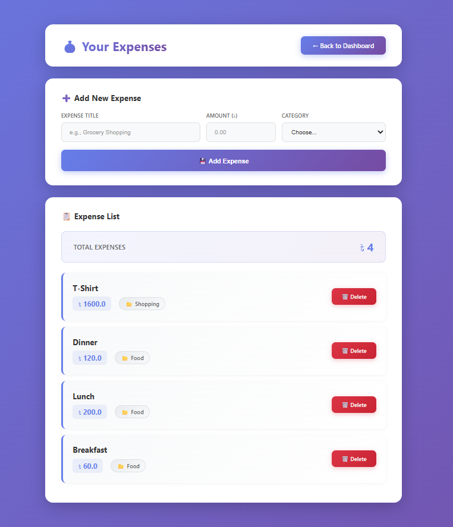
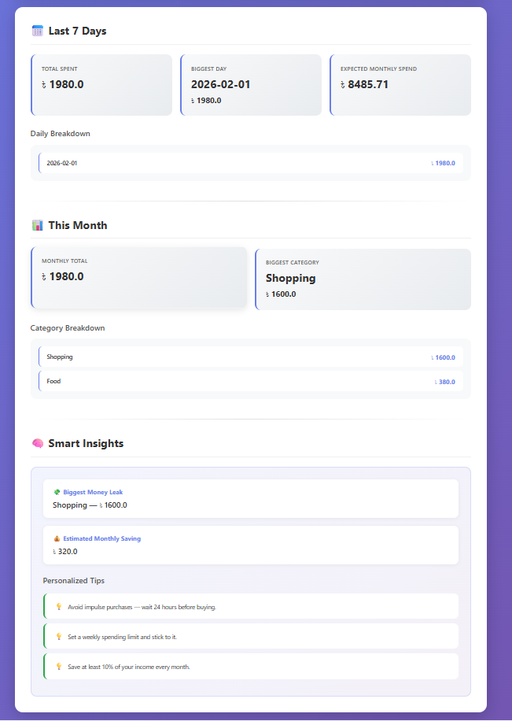

# 🚀 SpendSense AI — Intelligent Financial Coach

An intelligent expense tracking and financial advisory application powered by AI-driven insights. Track your spending, get personalized financial tips, and make smarter money decisions.

## 📋 Table of Contents

- [Features](#features)
- [Use Cases](#use-cases)
- [Tech Stack](#tech-stack)
- [Installation](#installation)
- [Project Structure](#project-structure)
- [Configuration](#configuration)
- [Usage](#usage)
- [API Endpoints](#api-endpoints)
- [Screenshots](#screenshots)
- [Future Enhancements](#future-enhancements)
- [License](#license)

## ✨ Features

### 1. **User Authentication**
- Secure user registration and login system
- Password-protected accounts
- Session management
- Logout functionality

### 2. **Expense Tracking**
- Add, view, and delete expenses
- Categorize expenses (Food, Transport, Shopping, Bills, Entertainment, Health, Education, Other)
- Record expense amounts and timestamps
- Real-time expense management
- Expense history with sorting by latest first

### 3. **Dashboard & Analytics**
- **Weekly Analysis**: View total spending for the last 7 days
- **Daily Breakdown**: See spending patterns day-by-day
- **Monthly Overview**: Track monthly spending trends
- **Category Analysis**: Identify spending patterns by category
- **Smart Predictions**: AI-powered monthly spending forecast based on weekly averages
- **Biggest Day Tracking**: Identify your highest spending day
- **Biggest Category**: Know where most of your money goes

### 4. **AI-Powered Financial Insights**
- **Personalized Tips**: Get category-specific financial advice
  - Food: Reduce eating outside — cook at home twice a week
  - Transport: Try walking or public transport for short trips
  - Shopping: Avoid impulse purchases — wait 24 hours before buying
  - Other: Track small expenses — they add up quickly
- **General Recommendations**: Best practices for saving and budgeting
- **Estimated Savings**: Calculate potential monthly savings (20% of top category)

### 5. **Report Generation**
- PDF report generation using ReportLab
- Detailed expense reports for analysis and archival

## 🎯 Use Cases

### Personal Finance Management
- Track daily personal expenses
- Understand spending habits
- Identify areas where you overspend

### Budgeting & Planning
- Monitor monthly budgets
- Receive AI-driven recommendations to reduce spending
- Plan future expenses based on predictions

### Financial Awareness
- Get insights into spending patterns
- Identify wasteful spending categories
- Learn healthy financial habits through personalized tips

### Tax & Record Keeping
- Maintain expense history
- Generate reports for accounting purposes
- Export expense data for analysis

## 🛠️ Tech Stack

### Backend
- **Framework**: Django 6.0.1
- **Database**: SQLite (can be configured for PostgreSQL)
- **Server**: Gunicorn (production-ready WSGI server)
- **PDF Generation**: ReportLab 4.4.9
- **Authentication**: Django built-in auth system

### Frontend
- **HTML Templates**: Django templates
- **Styling**: CSS (custom stylesheets)
- **JavaScript**: Interactive expense management

### Deployment
- **Platform**: Heroku (Procfile included)
- **Environment**: Python with pip package management

## 📦 Dependencies

```
asgiref==3.11.0
charset-normalizer==3.4.4
Django==6.0.1
gunicorn==24.1.1
packaging==26.0
pillow==12.1.0
python-dotenv==1.2.1
reportlab==4.4.9
sqlparse==0.5.5
tzdata==2025.3
```

## 🚀 Installation

### Prerequisites
- Python 3.8 or higher
- pip (Python package manager)
- Virtual environment (optional but recommended)

### Setup Instructions

1. **Clone the repository**
   ```bash
   git clone https://github.com/khandakeraliariyan/SpendSenseAI.git
   cd SpendSenseAI
   ```

2. **Create a virtual environment**
   ```bash
   python -m venv venv
   ```

3. **Activate the virtual environment**
   - **Windows**:
     ```bash
     venv\Scripts\activate
     ```
   - **macOS/Linux**:
     ```bash
     source venv/bin/activate
     ```

4. **Install dependencies**
   ```bash
   pip install -r requirements.txt
   ```

5. **Navigate to backend directory**
   ```bash
   cd backend
   ```

6. **Apply database migrations**
   ```bash
   python manage.py migrate
   ```

7. **Create a superuser (optional, for admin panel)**
   ```bash
   python manage.py createsuperuser
   ```

8. **Run the development server**
   ```bash
   python manage.py runserver
   ```

9. **Access the application**
   - Open your browser and go to `http://localhost:8000`

## 📁 Project Structure

```
SpendSenseAI/
├── backend/
│   ├── accounts/              # User authentication app
│   │   ├── models.py
│   │   ├── views.py          # Login, Register, Logout
│   │   ├── urls.py
│   │   ├── admin.py
│   │   └── templates/
│   │       ├── login.html
│   │       └── register.html
│   │
│   ├── expenses/              # Expense tracking app
│   │   ├── models.py         # Expense model with categories
│   │   ├── views.py          # Expense CRUD operations
│   │   ├── urls.py
│   │   ├── admin.py
│   │   ├── migrations/
│   │   └── templates/
│   │       └── expenses.html
│   │
│   ├── dashboard/             # Analytics & insights app
│   │   ├── models.py
│   │   ├── views.py          # Dashboard analytics & AI insights
│   │   ├── urls.py
│   │   ├── admin.py
│   │   └── templates/
│   │       └── dashboard.html
│   │
│   ├── core/                  # Django project settings
│   │   ├── settings.py       # Project configuration
│   │   ├── urls.py           # URL routing
│   │   ├── wsgi.py           # WSGI config for deployment
│   │   └── asgi.py           # ASGI config
│   │
│   ├── manage.py             # Django management script
│   └── db.sqlite3            # Development database
│
├── requirements.txt          # Python dependencies
├── Procfile                  # Heroku deployment config
├── README.md                 # This file
└── LICENSE                   # Project license

```

## ⚙️ Configuration

### Environment Variables
Create a `.env` file in the `backend` directory for environment-specific settings:

```bash
DEBUG=True
SECRET_KEY=your-secret-key-here
ALLOWED_HOSTS=localhost,127.0.0.1
DATABASE_URL=sqlite:///db.sqlite3
```

### Database Configuration
- **Development**: SQLite (default)
- **Production**: PostgreSQL (recommended)

Update `backend/core/settings.py` to configure the database as needed.

## 💻 Usage

### 1. Register a New Account
- Navigate to the registration page
- Enter username and password
- Click "Register"

### 2. Login
- Use your credentials to login
- You'll be redirected to the dashboard

### 3. Add an Expense
- Go to the Expenses page
- Fill in the expense details (title, amount, category)
- Click "Add Expense"

### 4. View Dashboard
- Navigate to the Dashboard
- View your weekly, monthly spending
- Get personalized financial tips
- Check predicted monthly spending

### 5. Delete an Expense
- On the Expenses page, click the delete button next to an expense
- The expense will be removed immediately

## 🔗 API Endpoints

| Endpoint | Method | Description |
|----------|--------|-------------|
| `/` | GET | Home page |
| `/accounts/register/` | GET, POST | User registration |
| `/accounts/login/` | GET, POST | User login |
| `/accounts/logout/` | GET | User logout |
| `/dashboard/` | GET | Dashboard with analytics |
| `/expenses/` | GET, POST | View and add expenses |
| `/expenses/<id>/delete/` | GET | Delete an expense |
| `/admin/` | GET, POST | Django admin panel |

## 🎨 Screenshots

### Login Page
Secure authentication interface for user access.


### Registration Page
Easy account creation for new users.


### Dashboard
Visual analytics and AI insights with spending overview.


### Expenses Management
Track and manage all your expenses in one place.


### Analytics
Weekly, monthly, and category-based spending patterns with intelligent insights.



## 👤 Author

**Khandaker Ali Ariyan**
- GitHub: [@khandakeraliariyan](https://github.com/khandakeraliariyan)
- Project: SpendSenseAI - Intelligent Financial Coach

## 🤝 Contributing

Contributions are welcome! Please feel free to submit a Pull Request with any improvements or new features.

## 📝 License

This project is licensed under the MIT License - see the [LICENSE](LICENSE) file for details.

---

**Made with ❤️ for better financial management**

